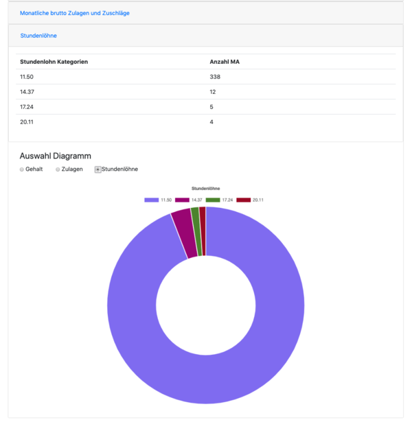

# Salary Structure Evaluation

Evaluation and visualization of the salary structure of an enterprise.

Data provided as CSV-files. Fetching and preparing of the data done by using PHP. JavaScript, HTML and CSS used for the presentation.

## Prerequisite

Web Server with enabled PHP 5 module.

## Used libraries

- [Bootstrap 4](https://getbootstrap.com/)

- [Chart.js 2.5](https://www.chartjs.org/)

## Links

- [Read CSV from a file line by line](https://www.php.net/manual/de/function.fgetcsv.php)

- [Transfer a PHP-array to JSON](https://www.php.net/manual/en/function.json-encode.php)

- [How to pass PHP-data to JavaScript](https://www.dyn-web.com/tutorials/php-js/scalar.php)

